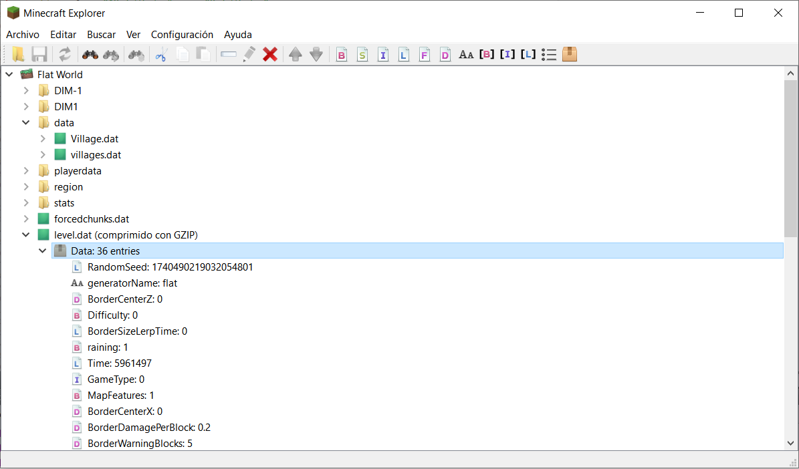

# MinecraftExplorer

MinecraftExplorer es un programa para explorar/editar archivos de datos NBT.

Este programa está inspirado en [NBTExplorer](https://www.minecraftforum.net/forums/mapping-and-modding-java-edition/minecraft-tools/1262665-nbtexplorer-nbt-editor-for-windows-and-mac).

Además visualiza archivos JSON que también son utilizados por Minecraft (ej, los stats).

Idiomas:

* Inglés
* Español

Imágenes:

